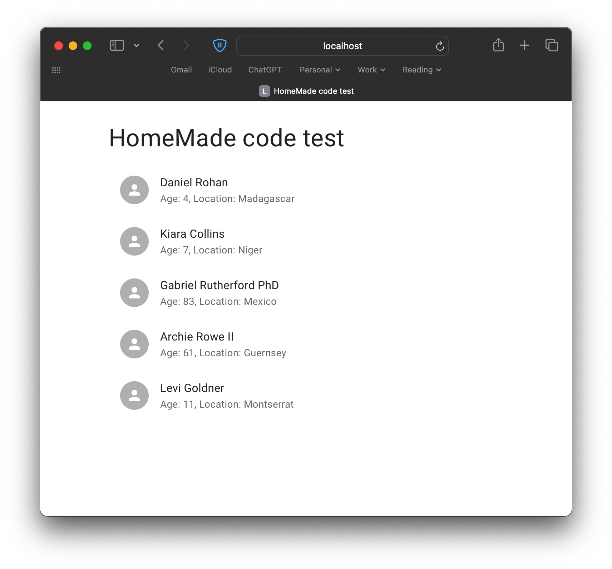
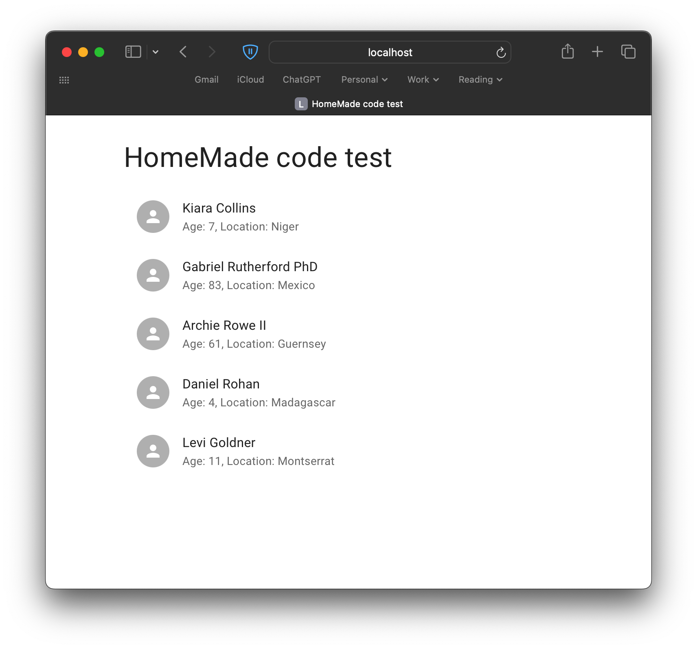

# HomeMade code test

Completed by James U, 2024-05-27

## Requirements

- Create a simple `nodejs` service that has ONE GET endpoint which returns an array of
  objects (name, age, location).
- Create a `react` frontend using Material UI that displays a list of people (name, age, location) in a list with the ability to drag and drop the order. This list should be retrieved from the `nodejs` service and use Material UI elements.
- Create a unit test in `jest` for the React frontend.

## Implementation caveats

Whilst all requirements have been fully implemented

- `vite + testing-library` was chosen over `jest` as the client side testing framework.
- frontend styling has been kept ot a minimum to reduce noise.

## Running locally

### Setup

Note: Please prefer `node 20` as specified by the `.nvmrc` file or at least `node 18`.

```sh
# Clone
git clone https://github.com/tenseventyseven/homemade-code-test.git
cd homemade-code-test

# Install deps
npm ci && (cd backend && npm ci) && (cd frontend && npm ci)

# Run dev
npm run dev

> homemade-code-test@1.0.0 dev
> concurrently "npm run backend" "npm run frontend"

[1]
[1] > homemade-code-test@1.0.0 frontend
[1] > npm run dev --prefix frontend
[1]
[0]
[0] > homemade-code-test@1.0.0 backend
[0] > npm run dev --prefix backend
[0]
[1]
[1] > frontend@1.0.0 dev
[1] > vite
[1]
[0]
[0] > backend@1.0.0 dev
[0] > tsx watch src/index.ts
[0]
[1]
[1]   VITE v5.2.11  ready in 253 ms
[1]
[1]   ➜  Local:   http://localhost:5173/
[1]   ➜  Network: use --host to expose
[0] Server is running on http://localhost:3000
```

### Try it out

Browse to <http://localhost:5173>. 5 persons will be randomly generated by the backend:



Try dragging `Daniel Rohan` down to between `Archie Rowe II` and `Levi Goldner` for example:



Or call the backend directly:

```sh
# Invalid route
curl -s -X POST http://localhost:3000/not/a/valid/route | jq
{
  "message": "Not found"
}

# GET /api/v1/persons (note 5 random persons returned each time)
curl -s -X GET http://localhost:3000/api/v1/persons | jq
{
  "persons": [
    {
      "id": "417d2db9-9c6e-4406-bf59-90bcdea5f2c1",
      "name": "Mrs. Alexis Quigley II",
      "age": 49,
      "location": "Belgium"
    },
    {
      "id": "187695f8-0e81-4e8d-ad0c-55830747269f",
      "name": "Amy Cassin",
      "age": 10,
      "location": "Russian Federation"
    },
    {
      "id": "1e0e1b5f-715b-42a8-9632-d2a6fcc584ee",
      "name": "Benjamin Bartoletti",
      "age": 93,
      "location": "Sri Lanka"
    },
    {
      "id": "6ea1781a-2ed8-4165-8ff7-a79ea8b1e94e",
      "name": "Phoebe Quinn",
      "age": 4,
      "location": "Switzerland"
    },
    {
      "id": "ea917414-a526-4c76-bfcb-1ca7fb3b0bab",
      "name": "Grace Bartoletti",
      "age": 50,
      "location": "Suriname"
    }
  ]
}
```

## Frontend

Bootstrapped with official Material UI [example project for `vite`](https://github.com/mui/material-ui/tree/next/examples/material-ui-vite-ts) as a simple SPA.

### Dependencies

- maintained fork of [`react-beautiful-dnd`](https://github.com/hello-pangea/dnd) for drag-and-drop functionality.
- [`@tanstack/react-query`](https://tanstack.com/query/latest) for async server state management.

### Dev dependencies

- [`vitest`](https://vitest.dev) as the test runner instead of `jest` for modern features and compatibility
- [`@testing-library`](https://testing-library.com) as the React testing library instead of `jest` again for modern features and compatibility

### Notes

- Fetching the API data from server is done at the top level in `App` component
- `Persons` component uses the fetched server data as initial state but manages it's own list of persons as client state
- Components are broken down into `Persons`, `PersonList`, `PersonListItem` to keep components small, composable, testable and easy to reason about.
- Tests are included for:
  - `reorder()` to test logic
  - `Persons` to test rendering and drag-drop functionality

```sh
npm run test

> frontend@1.0.0 test
> vitest run


 RUN  v1.6.0 /Users/james.u/Personal/homemade/frontend

 ✓ src/utils.test.ts (2)
 ✓ src/components/Persons.test.tsx (2)

 Test Files  2 passed (2)
      Tests  4 passed (4)
   Start at  16:19:14
   Duration  602ms (transform 44ms, setup 145ms, collect 137ms, tests 76ms, environment 355ms, prepare 89ms)
```

## Backend

Backend is created from scratch as a simple [`express`](https://expressjs.com) server written in `typescript`.

### Dependencies

- `express` for the HTTP server including [cors](https://github.com/expressjs/cors) for CORS setup (as we're running client and server on two different ports locally).
- [`http-status-codes`](https://github.com/prettymuchbryce/http-status-codes) not strictly necessary but nice to use official enums for code readability.

### Dev dependencies

- [`@faker-js`](https://fakerjs.dev) for generating random persons data
- [`eslint`](https://eslint.org) and [`prettier`](https://prettier.io) setup for linting and formatting
- [`husky`](https://typicode.github.io/husky/) and [`lint-staged`](https://github.com/lint-staged/lint-staged) to enforce code quality and passing tests before committing
- [`mocha`](https://mochajs.org), [`chai`](https://www.chaijs.com) , [`sinon`](https://sinonjs.org) and [`supertest`](https://github.com/ladjs/supertest) for `node` testing
- [`tsx`](https://tsx.is) to run `typescript` directly in `dev` mode (like `ts-node`)

### Notes

- Minimal REST API with only `GET /api/v1/persons` endpoint and a catch-all route
- The `Person` resource and its associate model, routes etc are grouped under `/person`
- `person/data.ts` is a hardcoded proxy for a real datasource using `@faker-js` to produce random data. In a real implementation this would be a database of some sort.
- Tests are included for:
  - `generateData()` utility function
  - `findAll()` datasource proxy function
  - `app` REST API valid and invalid endpoints

```sh
npm run test

> backend@1.0.0 test
> mocha --import=tsx 'test/**/*.test.ts' --exit

Server is running on http://localhost:3000


  app
    ✔ Returns 404 with expected body for catch-all route
    ✔ Returns 200 with expected body for GET /api/v1/persons

  findAll
    ✔ should generate a known number of persons

  generateData
    ✔ should generate a list of fake persons


  4 passing (20ms)
```

- The `eslint/prettier/husky/lint-staged` setup is correct for `homemade/backend` as a standalone repo. I did not set up the equivalent in `homemade/frontend` but the concept is the same for `eslint/prettier` but with `React` config rather than `node`. Or I would otherwise investigate setting this up as a proper monorepo using something like [turborepo](https://turbo.build/repo).
